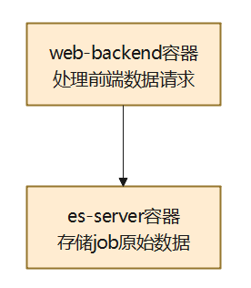

## 1. 需求分析：

### 1.1 需求链接

https://r.huaweistatic.com/s/kunpengstatic/lst/files/pdf/ecosystem/ecology_remit/20220630170008.pdf

### 1.2 功能描述
> 性能基线/性能测试页面：用户在网页左侧导航栏上选择基础性能（CPU/内存/存储/网络/基础库）中一个特性，右侧实现某个测试组件所有的测试数据展示
> 对比检索页面：

### 1.3 功能原型设计

https://modao.cc/app/IUs90Nvri8odsTP3U18oR#screen=sl82p1aoqxqf18o

## 2. 方案设计

### 2.1 整体方案分析



### 2.2 详细设计

#### 2.2.1 新增、修改、删除点分析
> web-backend: 新增用于标准化POST数据的模块，前端只选择suite名称，会展示全部的数据
> es-server: 新增专门用于存储数据的表单
> web-backend：基于新增的存储性能数据的表单，修改query_field数据筛选按钮的反馈
> web-backend: 修改原有对比检索页面，反馈的数据格式，新增对单个表单的几何平均值的数据反馈

#### 2.2.2 API设计
```
web-backend:
输入：网页上选中某个测试组件（例如：unixbench）
/performance_result/unixbench/?limit=10
输出：
{
    "count": 12,
    "results": [
        {
            "guid": "$submit_id",
            # 测试人 
            "created_by": "$my_account", # 指标
            # 审核人
            "tested_by": "", # 当数据未经过审核时，不进行展示
            "task_belongs_type": null,
            "task_belongs_id": null,
            # 硬件配置
            "product": {
                "product_id": "",
                # 服务器型号
                "model": "Kunpeng-Taishan 200", # 指标
                # 处理器
                "cpu_brief": "", # 指标：CPU配置
                # CPU频率(MHz) 
                "frequency_mhz": 2500,
                "cpus": 80, 
                "threads": 80,
                "series": null,
                # 内存规格
                "memory_brief": "", # 指标： 内存配置
                # 内存型号
                "memory_model": "",
                # 硬盘规格
                "disk_brief": "", # 指标： 硬盘配置
                # 硬盘型号
                "disk_model": "",
                # RAID卡
                "raid_brief": "",
                # 网卡
                "nic_brief": "",
                # 电源
                "psu_brief": "",
                # 单板
                "board_brief": "",
                # 处理器$cpu_brief的详细信息(点击弹窗显示)
                "cpu_detail": {},
                "memory_detail": {},
                "disk_detail": {},
                "nic_detail": {},
                "psu_detail": {},
                "board_detail": {},
                "bios_version": "7.55 (U47)",
                # BMC版本
                "bmc_version": "",
                # BIOS版本
                "bios_version": "",
                # BIOS配置
                "bios_detail": {
                    "NUMA": "Enable",
                    "Power": "Custom",
                    "Custom Refresh": "Disabled",
                    "Hardware Prefetcher": "Enable",
                    "Adjacent Cache Prefetch": "Enable"
                }
            }, 
            # 软件配置（详情页）
            "os": {
                # 操作系统
                "os_release": "$os-$os_version", # 指标
                # 系统内核
                "os_kernel": "",
                # 编译器版本
                "compiler_version": "",
                # GLIBC版本
                "glibc_version": "",
                # JDK版本
                "jdk_version": null,
                # 内核参数
                "kernel_parameters": null,
                # NUMA
                "numa": null,
                # 命令行
                "cmdline": null,
                # 文件系统
                "file_system": null
            },
            # 用例信息（详情页）
            "case_result": {
                "case_result_id": "",
                # selinux
                "selinux": "",
                # result_publish_type
                "result_publish_type": "performance_baseline_data",
                # source
                "source": "openEuler" # 指标：数据来源
                "batch_uid": "2022-09-22 09:13:12.045408_027"
                # 操作系统页表大小
                "os_pagesize": "",
                # 测试工具版本
                "tool_version": "",
                # CMC版本号
                "cmc_version": "",
                # 配置文件
                "config_files": null,
                # 测试用例名称 
                "testcase_name": "", # 指标：测试用例名称
                # Workload性能值
                "workload_data": {},
                # 性能值
                "performance_data": 1231, # 指标：性能数据
                # 单位(描述)
                "unit": null,
                # 指标
                "metrics": null,
                "flow": ""
            },
            "publish_type": "performance_baseline_data",
            # 数据状态： 未审核，已审核
            "public_state": "Untracked/tracked"
            "create_date": "$submit_time",
            "secret_level": "process_data",
            "system_info": null,
            "micro_file": null,
            "macro_file": null,
            "power_file": null,
            "container_file": null

        }
    ]
}
```

```
web-backend:
输入：确认某个测试组件的测试用例名称，只有在测试用例一致的情况下，可以进行详情数据对比(例如： unixbench)
/performance_result/unixbench/?distinct=unixbench_testcase_name
输出：
["单核"， "多核"]
```

```
web-backend：
输入：确认不少于两组以上的测试数据
输出：
{
    # 技术规格表格信息
    "specification": {
        # 技术规格表格的表头
        "table_header": [
            "CPU型号"，
            "操作系统",
            "内核版本",
            "selinux",
            "页表大小",
            "GCC编译器版本",
            "glibc版本",
            "文件系统"
        ],
        "data": [[], []] 
    }
    "charts": [
        {
            # 柱状图的x轴指标
            "xAxisData": [ 
                "Dhrystone_"
            ],
            # y值
            "seriesData":[
                {
                    # 其中一个os版本
                    "os_release": ""
                    performance_data: 123,
                    "data": [
                        "1893"
                    ]
                }，
                {
                    # 另一个os版本
                    "os_release": ""
                    performance_data: 123,
                    "data": [
                        "1893"
                    ]
                }
            ]
            # 柱状图上鼠标滑过显示每一项的性能提升率
            "x_ratio_table": {
                "table_header": [
                    "操作系统",
                    "性能值",
                    "性能比"
                ],
                "data": [[],[]]
            },
            # 图片名称
            # 单位
            "title": "",
            "unit": "",
        }
    ]，
    # 总比表格信息
    "total_ratio_table": {
        "table_header": [
            "",
            "openEuler-20.03",
            "openEuler-20.09",
            "openEuler-20.03 vs openEuler-20.09"
        ],
        "data": [[],[]]
    }
}

```
